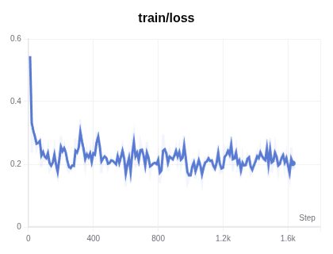
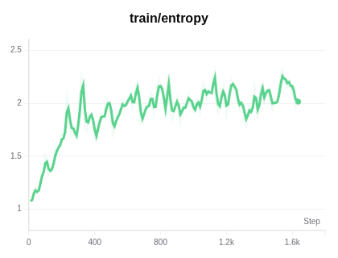
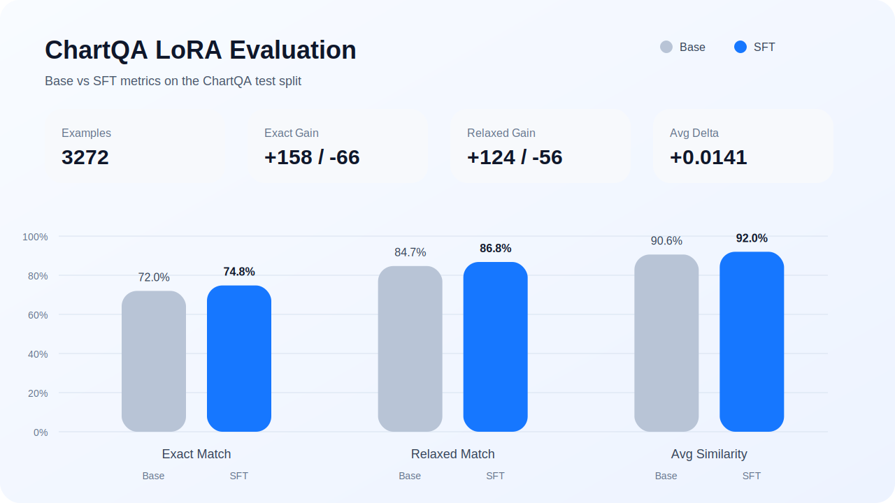
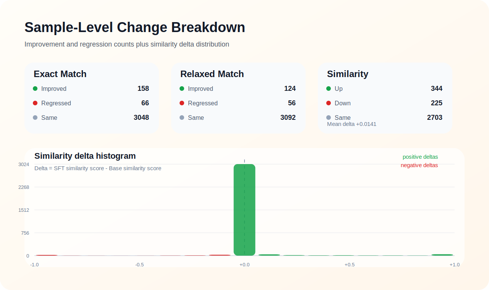

<div align="center">

# 面向 ChartQA 的工具增强多模态 RL

<p>基于 <code>Qwen3-VL-4B-Instruct</code> 的 ChartQA 项目，覆盖 <code>LoRA</code> 监督微调与基于 <code>VeRL</code> 的工具增强多模态 <code>RL</code>。</p>

</div>

当前仓库提供数据下载、SFT 训练、LoRA 合并、离线评测，以及 RL 数据预处理与训练入口。

## 数据集

| 阶段 | 数据 | 用途 |
| --- | --- | --- |
| SFT | `swift/ChartQA` | 监督微调与离线评测 |
| RL | `ChartQA` 图像 + `RL/data/train_chartqa_vcot.zip` | 预处理生成 RL 训练 parquet |

## SFT

SFT 基于 `Qwen3-VL-4B-Instruct` 在 ChartQA 上进行 LoRA 微调，merged model 作为后续 RL 的初始化模型。当前离线评测基于 `ChartQA test split (3272 samples)`。

| Model | Exact Match | Relaxed Match | Avg Similarity |
| --- | ---: | ---: | ---: |
| Base | 72.0% | 84.7% | 90.6% |
| SFT (LoRA) | 74.8% | 86.8% | 92.0% |

**训练曲线**

<table>
  <tr>
    <td align="center"></td>
    <td align="center"></td>
  </tr>
</table>

**离线评测**

<table>
  <tr>
    <td align="center"></td>
    <td align="center"></td>
  </tr>
</table>

## RL

RL 部分基于 `VeRL` 提供 ChartQA 工具增强多模态训练入口，默认从 SFT merged model 初始化。

| 项目 | 默认值 |
| --- | --- |
| 训练入口 | `RL/train.sh` |
| 初始化模型 | `sft_merged_dir` |
| 训练数据 | `rl_parquet_dir/train_full.parquet` |
| 验证数据 | `rl_parquet_dir/val_full.parquet` |
| checkpoint | `rl_checkpoint_dir` |

## 快速开始

1. 创建环境

```bash
conda env create -f environment.yml
conda activate chartqa-rl
```

2. 配置路径

```bash
cp config/paths.example.json config/paths.json
```

`config/paths.json` 控制本地路径；如需放在别处，可用 `CHARTQA_PATH_CONFIG=/abs/path/to/paths.json` 覆盖。

3. 下载模型并运行 SFT

```bash
bash LoRA/download_models.sh
bash LoRA/download_data.sh
python LoRA/chartqa_sft.py --config LoRA/configs/chartqa_qwen3vl4b.json
python LoRA/merge_lora.py --config LoRA/configs/chartqa_qwen3vl4b.json
python LoRA/chartqa_eval.py --config LoRA/configs/chartqa_qwen3vl4b.json
```

4. 预处理 RL 数据并启动训练

```bash
bash RL/data/preprocess_data.sh
bash RL/train.sh
```

常用覆盖项：

```bash
MODEL_PATH=/abs/path/to/merged \
TRAIN_FILE=/abs/path/to/train_full.parquet \
VAL_FILE=/abs/path/to/val_full.parquet \
CHECKPOINT_DIR=/abs/path/to/rl_checkpoints \
bash RL/train.sh
```
