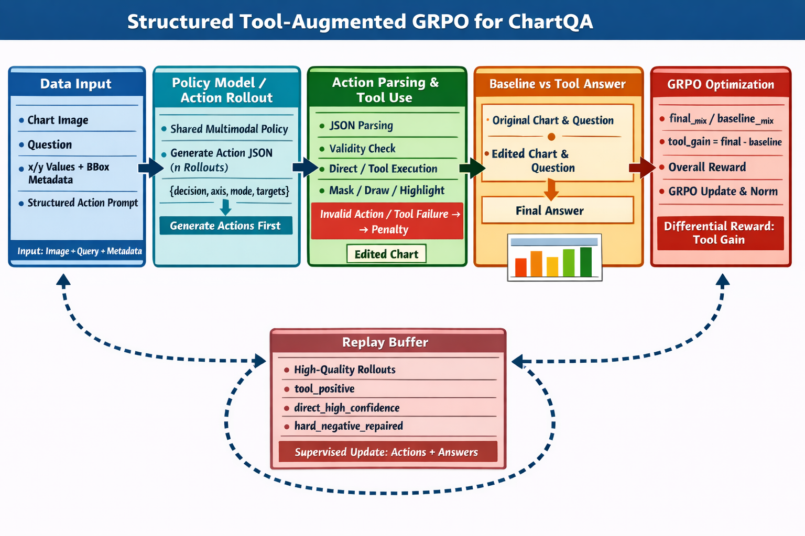

# RL / VeRL

[返回项目首页](../README.md)

## 概览

这一部分实现面向 ChartQA 的工具增强多模态强化学习流程，训练框架基于 `VeRL + GRPO`。底层仍沿用 VeRL 的 PPO-family trainer skeleton（代码里会看到 `RayPPOTrainer`），但当前实验算法口径是 `adv_estimator=grpo`。默认链路不是自由形式 Python tool call，而是显式的两阶段 structured RL：

1. `action branch` 先输出结构化动作 JSON
2. `baseline branch` 在原图上直接回答问题
3. `tool answer branch` 在动作合法且执行成功时，基于原图和编辑图生成最终答案
4. reward 使用答案质量、工具收益、调用成本和非法动作惩罚的混合目标
5. 高质量 rollout 会写入 replay buffer，并在 actor 更新后追加 supervised replay update

所有命令都默认从仓库根目录执行：

```bash
cd /abs/path/to/chartqa-rl
```

## 算法框架

当前 RL 管线的整体结构如下图所示：

<p align="center">
  
</p>

## 方法设计

当前默认训练流程由三条分支组成：

| 分支 | 输入 | 输出 | 作用 |
| --- | --- | --- | --- |
| `action branch` | 原图 + ChartQA prompt | 结构化动作 JSON | 决定是否调用工具以及如何调用 |
| `baseline branch` | 原图 + 原始问题 | baseline answer | 作为 no-tool 对照 |
| `tool answer branch` | 原图 + 编辑图 + 原始问题 | final answer | 评估工具是否真实带来收益 |

最终 reward 不是单看最终答案，而是把 tool 前后的质量差异一起纳入优化。这样可以避免策略只学会“形式上调用工具”，却没有带来真实回答收益。

## 目录与关键组件

| 文件 | 作用 |
| --- | --- |
| `RL/train.sh` | RL 主训练入口，负责拼装路径、配置和常用覆盖项 |
| `RL/examples/config.yaml` | VeRL 训练默认配置 |
| `data/rl/preprocess_data.sh` | 下载图像并生成 RL parquet |
| `data/rl/preprocess.py` | 将原始 ChartQA 图像与标注转换为训练 parquet |
| `data/chartqa/rl.py` | RL 预处理的共享 ChartQA 数据层逻辑 |
| `data/chartqa/common.py` | LoRA 与 RL 共用的答案归一化与匹配逻辑 |
| `RL/examples/format_prompt/chartQA_action.jinja` | structured action 的 prompt 模板 |
| `RL/examples/reward_function/structured_chartqa.py` | 差分收益 reward 与 LLM Judge 混合奖励 |
| `RL/verl/tooluse/structured_chartqa.py` | 动作解析、合法性校验、工具执行与回答 prompt 构建 |
| `RL/verl/trainer/replay_buffer.py` | 高质量 rollout replay buffer |
| `RL/evaluate_structured.py` | 统一评测脚本，复用与训练一致的 structured pipeline |
| `RL/judge/judge_info.example.json` | LLM Judge 运行时配置模板 |

## 路径与依赖

运行前先准备路径配置：

```bash
cp config/paths.example.json config/paths.json
```

RL 部分常用路径键如下：

| 键 | 含义 |
| --- | --- |
| `rl_raw_dir` | 原始图像和中间解压目录 |
| `rl_parquet_dir` | 预处理后的 `train_full.parquet` / `val_full.parquet`，以及默认 replay buffer 目录 |
| `sft_merged_dir` | RL 默认初始化模型 |
| `rl_checkpoint_dir` | RL checkpoint 主目录 |

当前默认不强制依赖 `flash-attn`。配置里 `worker.actor.padding_free=false`，FSDP worker 会走 `sdpa` fallback，因此 RL 可以直接启动；代价是训练更慢、显存更吃紧。如果后续手动把 `padding_free=true`，则需要自行安装 `flash-attn`。

## 数据预处理

RL 训练使用的是预处理后的 parquet，而不是直接读取原始图片目录。执行：

```bash
bash data/rl/preprocess_data.sh
```

这个脚本会完成三件事：

1. 下载 `ChartQA.zip`
2. 解压 `data/rl/train_chartqa_vcot.zip`
3. 运行 `data/rl/preprocess.py`，生成训练与验证 parquet

默认输出：

| 文件 | 默认位置 |
| --- | --- |
| 训练集 | `rl_parquet_dir/train_full.parquet` |
| 验证集 | `rl_parquet_dir/val_full.parquet` |
| replay buffer | `rl_parquet_dir/replay/buffer.jsonl` |

每条 parquet 样本会包含：

| 字段 | 说明 |
| --- | --- |
| `metadata` | 图表类型、bbox、候选标签等结构化信息 |
| `figure_id` | 图表 ID |
| `figure_path` | 图像相对路径 |
| `query` | 原始问题 |
| `prompt` | 第一阶段动作生成 prompt |
| `answer` | 标注答案 |
| `images` | 二进制图像内容 |

如果原始数据放在自定义位置，可以临时覆盖：

```bash
CHARTQA_RAW_DIR=/abs/path/to/raw_data bash data/rl/preprocess_data.sh
```

## 训练流程

先复制并填写 Judge 配置：

```bash
cp RL/judge/judge_info.example.json RL/judge/judge_info.json
```

然后启动训练：

```bash
bash RL/train.sh
```

常用覆盖项示例：

```bash
MODEL_PATH=/abs/path/to/merged_model \
TRAIN_FILE=/abs/path/to/train_full.parquet \
VAL_FILE=/abs/path/to/val_full.parquet \
CHECKPOINT_DIR=/abs/path/to/rl_checkpoints \
REPLAY_BUFFER_DIR=/abs/path/to/replay_buffer \
GLOBAL_BATCH_SIZE=8 \
MICRO_BATCH_SIZE=1 \
ROLLOUT_BATCH_SIZE=16 \
bash RL/train.sh
```

`RL/train.sh` 会默认做这些事情：

- 从 `sft_merged_dir` 读取初始化模型
- 从 `rl_parquet_dir` 读取 train / val parquet
- 将 checkpoint 写入 `rl_checkpoint_dir`
- 将 replay buffer 写入 `rl_parquet_dir/replay`
- 使用 `structured_chartqa` reward
- 使用 `examples/config.yaml` 中的 structured action 配置

## 结构化动作空间

第一阶段模型输出必须是 JSON，对应 schema 如下：

```json
{
  "decision": "direct" | "tool",
  "chart_axis": "x" | "y",
  "edit_mode": "mask" | "draw" | "highlight",
  "targets": ["label1", "label2"]
}
```

动作约束来自 `RL/verl/tooluse/structured_chartqa.py`：

| 字段 | 约束 |
| --- | --- |
| `decision` | 只能是 `direct` 或 `tool` |
| `chart_axis` | 只能是 `x` 或 `y` |
| `edit_mode` | 只能是 `mask`、`draw`、`highlight` |
| `targets` | 必须是当前样本 bbox 候选标签的非空子集，且不能重复 |

图表类型约束：

- `v_bar` 只允许 `x`
- `h_bar` 只允许 `y`

非法情况会被判为 invalid action，例如：

- 缺少 JSON
- `decision` 非法
- `chart_axis` 与图表类型不匹配
- `targets` 为空、重复、越界或不在候选集中

如果动作合法且 `decision=tool`，系统会把它映射到固定工具函数，例如：

- `focus_on_x_values_with_mask`
- `focus_on_x_values_with_draw`
- `focus_on_y_values_with_highlight`

## 差分收益奖励

reward 定义在 [`RL/examples/reward_function/structured_chartqa.py`](./examples/reward_function/structured_chartqa.py)，默认由 rule-based score 和 LLM Judge score 混合得到：

```text
final_mix = 0.4 * rule_score + 0.6 * judge_score
baseline_mix = 0.4 * baseline_rule_score + 0.6 * baseline_judge_score
tool_gain = final_mix - baseline_mix
overall = final_mix + 0.75 * tool_gain - tool_cost - invalid_penalty - ineffective_penalty
```

其中：

| 项 | 含义 |
| --- | --- |
| `rule_score` | 基于最终答案与标注答案的规则匹配分数 |
| `judge_score` | LLM Judge 对最终答案的二分类评分 |
| `baseline_mix` | 原图直接回答的混合分数 |
| `tool_gain` | 工具调用后相对 baseline 的收益 |
| `tool_cost` | 调用工具的固定成本，目标越多成本越高 |
| `invalid_penalty` | 非法动作或执行失败的惩罚 |
| `ineffective_penalty` | 合法工具调用但无正收益时的惩罚 |

训练和评测都会记录以下关键指标：

- `overall`
- `rule_score`
- `judge_score`
- `baseline_rule_score`
- `baseline_judge_score`
- `tool_gain`
- `tool_cost`
- `invalid_action`
- `tool_executed`
- `effective_tool`
- `answer_accuracy`

## LLM Judge 与缓存

Judge 配置文件模板是 [`RL/judge/judge_info.example.json`](./judge/judge_info.example.json)。常用字段如下：

| 字段 | 作用 |
| --- | --- |
| `host` | 本地 judge 服务地址，默认走 `http://host:7999/generate` |
| `openrouter_api_key` | 如果填写，则优先走 OpenRouter |
| `openrouter_model` | OpenRouter 使用的模型名 |
| `openrouter_base_url` | OpenRouter 接口地址 |
| `openrouter_http_referer` | 可选请求头 |
| `openrouter_app_title` | 可选应用标识 |

Judge 运行规则：

- 如果填写了 `openrouter_api_key`，默认走 OpenRouter chat completion
- 如果 `openrouter_api_key` 为空，则回退到本地 `host:7999` judge 服务

为了避免重复请求，Judge 会把评分结果写入缓存。默认缓存路径来自 `worker.reward.judge_cache_path`：

```text
./judge/cache/structured_chartqa_judge_cache.jsonl
```

同一条 `(query, ground_truth, answer)` 命中缓存后，不会重复请求外部 Judge。

## Replay Buffer 复用

高质量 rollout 会进入 trainer 侧 replay buffer，用于在策略更新之后追加 supervised replay update。默认实现位于 [`RL/verl/trainer/replay_buffer.py`](./verl/trainer/replay_buffer.py)。

默认准入逻辑：

- `tool` 样本要求 `final_mix >= 0.8` 且 `tool_gain >= 0.1`
- `direct` 样本要求 `final_mix >= 0.9`

默认 buffer 行为：

| 配置 | 默认值 | 说明 |
| --- | --- | --- |
| `buffer_size` | `50000` | 全局 buffer 上限 |
| `per_figure_limit` | `3` | 每个图表最多保留的高质量样本数 |
| `supervised_batch_size` | `32` | 每步 replay supervision 总 batch size |
| `loss_weight_action` | `0.4` | 动作监督 loss 权重 |
| `loss_weight_answer` | `0.6` | 答案监督 loss 权重 |

样本会按质量分到三个 bucket：

- `tool_positive`
- `direct_high_confidence`
- `hard_negative_repaired`

默认情况下，项目训练入口会把 replay buffer 放在：

```text
rl_parquet_dir/replay/buffer.jsonl
```

训练时的更新顺序是：

1. GRPO / policy update（运行在 VeRL 的 PPO-family trainer skeleton 上）
2. 从 replay buffer 采样动作监督样本
3. 从 replay buffer 采样答案监督样本
4. 执行一次 teacher-forcing supervised replay update

## 统一评测

统一评测入口：

```bash
python RL/evaluate_structured.py --model_path /abs/path/to/model_or_actor
```

常见覆盖项示例：

```bash
python RL/evaluate_structured.py \
  --model_path /abs/path/to/model_or_actor \
  --data_file /abs/path/to/val_full.parquet \
  --output_dir /abs/path/to/structured_eval \
  --max_samples 200
```

评测脚本会复用与训练一致的 structured pipeline：

1. 生成动作 JSON
2. 校验并执行动作
3. 生成 baseline answer
4. 生成 tool answer
5. 计算 mixed reward 和结构化指标

输出文件：

| 文件 | 说明 |
| --- | --- |
| `per_example.jsonl` | 每个样本的动作、baseline、tool answer、reward 详情 |
| `summary.json` | 汇总指标 |

如果不显式指定 `--output_dir`，默认输出到：

```text
{model_path.parent}/structured_eval/{model_path.name}
```

`summary.json` 的核心指标如下：

| 指标 | 含义 |
| --- | --- |
| `QAAccuracy` | 最终答案的规则准确率 |
| `ToolCallRate` | 选择 `decision=tool` 的比例 |
| `LegalActionRate` | 动作合法比例 |
| `ToolExecSuccessRate` | 合法工具动作中成功执行的比例 |
| `ToolEffectivenessRate` | 合法且执行成功的工具动作中，`tool_gain > 0.05` 的比例 |
| `AvgToolGain` | 成功工具调用样本上的平均工具收益 |
| `InvalidActionRate` | 非法动作比例 |
| `JudgeScore` | LLM Judge 平均分 |
| `RewardScore` | 平均综合 reward |

Base / SFT / RL 三阶段比较时，可以保持同一评测脚本不变，只替换 `--model_path`。

## 输出产物

| 产物 | 默认位置 | 说明 |
| --- | --- | --- |
| RL checkpoint | `rl_checkpoint_dir/global_step_*/{actor,critic}` | 训练过程中的 actor / critic checkpoint |
| replay buffer | `rl_parquet_dir/replay/buffer.jsonl` | 高质量 rollout 样本池 |
| Judge cache | `RL/judge/cache/structured_chartqa_judge_cache.jsonl` | 已评分答案缓存 |
| 结构化评测详情 | `{model_path.parent}/structured_eval/{model_path.name}/per_example.jsonl` | 每样本 trace |
| 结构化评测汇总 | `{model_path.parent}/structured_eval/{model_path.name}/summary.json` | 汇总指标 |

## 常见问题

**1. 为什么训练一开始就报 `judge_info.json not found`？**  
默认 reward 启用了 Judge。先执行 `cp RL/judge/judge_info.example.json RL/judge/judge_info.json`，再填写本地 judge 或 OpenRouter 信息。

**2. 不安装 `flash-attn` 能跑吗？**  
能。当前默认 `padding_free=false`，会走 `sdpa`。只是训练速度会更慢，显存压力也更大。

**3. `Model path does not exist` 是什么意思？**  
`RL/train.sh` 默认从 `sft_merged_dir` 读取初始化模型。先完成 LoRA merge，或者显式传入 `MODEL_PATH=/abs/path/to/merged_model`。

**4. 为什么工具调用很多，但收益不明显？**  
先看 `ToolEffectivenessRate`、`AvgToolGain`、`InvalidActionRate`。如果工具调用率高但收益低，通常说明动作空间过于激进、Judge 设置不稳定，或者 baseline 已经足够强。

**5. 显存不足怎么办？**  
优先减小 `MICRO_BATCH_SIZE`、`GLOBAL_BATCH_SIZE`、`ROLLOUT_BATCH_SIZE`，必要时降低 `data.max_prompt_length`、`data.max_response_length`，或者切到更大的 GPU。
